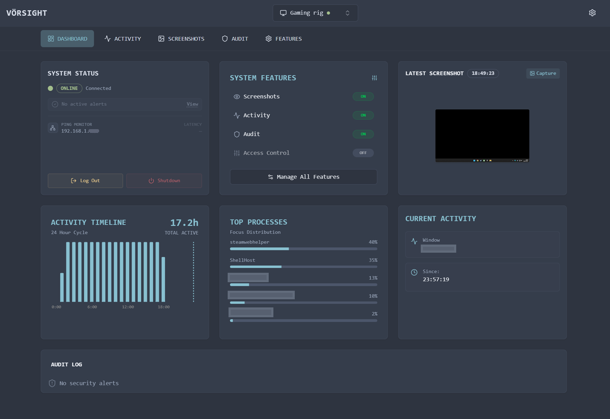

# Vörsight

**Vörsight** is a modern, self-hosted parental monitoring solution designed for privacy-conscious families. It combines a lightweight Windows agent with a centralized web dashboard to help you keep your children safe online while maintaining full ownership of your data.

> [!NOTE]
> Vörsight is currently under active development. The User Interface and features shown in screenshots may evolve as we continuously refine the UX and functionality.

## Features

### 🌐 Centralized Dashboard
*   **Real-time Monitoring**: View the online/offline status and active user for all connected machines instantly.
*   **Live Updates**: Dashboard updates in real-time via WebSockets, no refresh needed.
*   **Device Management**: Rename, archive, and manage your fleet of devices easily.



### 📸 Visual Activity Tracking
*   **Smart Screenshots**: Captures screen activity at configurable intervals (default every minute) while the user is active.
*   **Smart Filters**: Automatically skips redundant or identical screenshots before uploading them to reduce bandwidth and storage usage.
*   **Direct-to-Drive Uploads**: Screenshots are uploaded directly from the client PC to your personal Google Drive, ensuring privacy and speed.
*   **Interactive Timeline**: Browse history with a fluid, zoomable timeline that aggregates activity by hour and day.
*   **Gallery View**: Filter and view high-resolution screenshots with a dedicated gallery interface.


### 🛡️ Security & Auditing
*   **Session Auditing**: Automatically logs Windows session events including Login, Logout, Lock, and Unlock.
*   **Security Alerts**: Detects critical changes like User Creation, Local Group Membership changes, and Privilege Escalation.
*   **Audit Log**: A searchable, persistent log of all security events across your network, with dismissal and filtering capabilities.

### ⏰ Access Control
*   **Usage Scheduling**: Define specific time windows when computer usage is permitted.
*   **Strict Enforcement**: Automatically force logoff or shutdown when a user is outside their allowed schedule.
*   **Dynamic Warnings**: Users receive notifications before their time expires.

### 🔧 Architecture & Privacy
*   **Self-Hosted Server**: You run the server. No third-party cloud (other than your own Google Drive) touches your data.
*   **Secure Communication**: All client-server communication is authenticated via unique API keys.
*   **Client-Side Privacy**: Heavy media data (screenshots) goes straight to Google Drive, keeping your server lightweight and your data private.

## Getting Started

### 1. Requirements
- **Server**: A Linux machine (VPS, Raspberry Pi, etc.) to run the dashboard and API.
- **Client**: Windows PCs (Windows 10/11) to be monitored.
- **Google Cloud Project**: Required for Google Drive integration (storing screenshots).

### 2a. Server Setup (Linux)
Download the latest `vorsight-server-*.tar.gz` from [GitHub Releases](../../releases).

```bash
# Extract and install
tar -xzf vorsight-server-*.tar.gz
cd vorsight-server
sudo ./setup.sh
```

Follow the prompts to configure your admin account and Google Cloud credentials. The installer will generate a **Service Key** - keep this safe!

### 2b. Server Setup (Docker)
Alternative to the Linux script, you can run the server in a container.

```bash
docker run -d \
  -p 3000:3000 \
  -v vorsight-data:/app/prisma \
  -e WEB_PASSPHRASE="YourSecurePassphrase" \
  -e GOOGLE_CLIENT_ID="your-client-id" \
  -e GOOGLE_CLIENT_SECRET="your-client-secret" \
  --restart unless-stopped \
  --name vorsight-server \
  ghcr.io/linus-aldehag/vorsight:main
```

*   **`-v vorsight-data:/app/prisma`**: Persists the database.
*   **`-e ...`**: Configures the server. `JWT_SECRET` is auto-generated if not provided.

### 3. Client Installation (Windows)
Download `VorsightSetup.exe` from [GitHub Releases](../../releases) on the target PC.

1. Run the installer.
2. Enter your **Server Address** (e.g., `http://192.168.1.50:3000`).
3. Enter the **Service Key** provided during server setup.
4. The service will start automatically in the background.

## Configuration

### Google Drive Integration
Vörsight uses a secure, client-side upload architecture. Your server coordinates authentication, but the heavy lifting (file uploads) happens directly from the Windows PC to Google Drive.

1. **Create OAuth Credentials**: In your Google Cloud Console, create OAuth 2.0 credentials for a Web Application.
2. **Configure Server**: Provide the Client ID and Secret during server installation (or in `.env`).
3. **Connect**: Go to the **Settings** page in the Vörsight dashboard and click "Connect Google Drive" to authorize.

## Troubleshooting

- **Web Dashboard shows "Offline"**: Ensure the Windows client machine is turned on and has network access to the server. Check firewall rules on port 3000.
- **Screenshots not appearing**: Verify your Google Drive connection in Settings. Ensure the Windows client has the correct time and date settings.

---

## ⚖️ Legal & Contributing

- **Legal Notice**: Vörsight is intended for legal, transparent monitoring. See [LEGAL.md](LEGAL.md) for acceptable use and licensing details.
- **Contributing**: We welcome contributions! See [CONTRIBUTING.md](CONTRIBUTING.md) for development guides and project structure.
