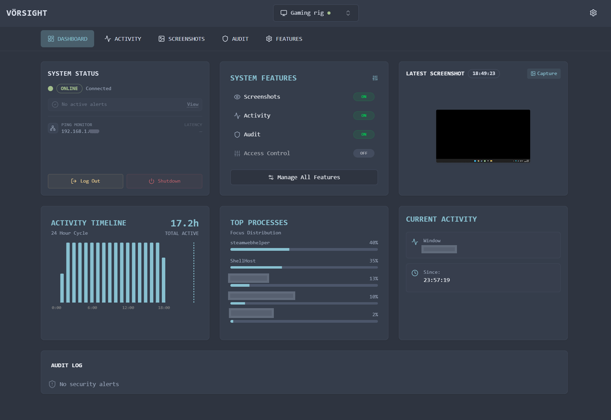
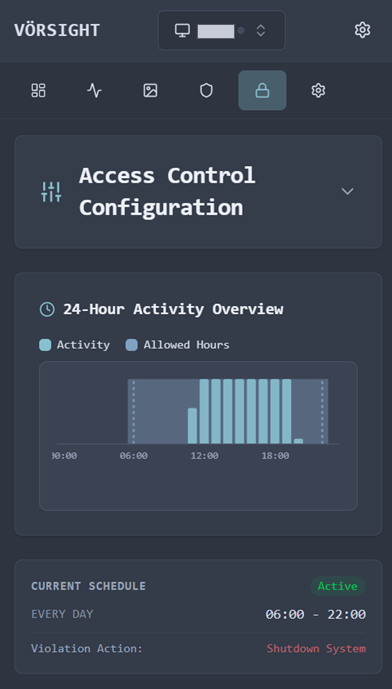

# Vörsight

**Vörsight** is a modern, self-hosted parental monitoring solution designed for privacy-conscious families. It combines a lightweight Windows agent with a centralized web dashboard to help you keep your children safe online while maintaining full ownership of your data.

[🌐 Live Demo](https://linus-aldehag.github.io/vorsight) • [📦 Releases](https://github.com/linus-aldehag/vorsight/releases) • [📜 Legal](LEGAL.md) • [🤝 Contributing](CONTRIBUTING.md)

> [!TIP]
> **Try the Interactive Demo**: Explore the web dashboard live at [linus-aldehag.github.io/vorsight](https://linus-aldehag.github.io/vorsight).

---

## Features

### 🌐 Centralized Dashboard
* **Real-time Monitoring**: Instant WebSocket updates for device status (online/offline) and active users without page refreshes.
* **Device Management**: Easily rename, archive, and manage your fleet of monitored devices.



### 📸 Visual Activity Tracking
* **Smart Screenshots**: Captures active screen state at configurable intervals (default: 1 min).
* **Deduplication**: Automatically skips identical/idle frames to save bandwidth and storage.
* **Direct-to-Drive**: Uploads screenshots directly from client PCs to your Google Drive, keeping your server lightweight.
* **Gallery View**: Dedicated interface for filtering and reviewing high-res captures.

### 🛡️ Security & Auditing
* **Session Auditing**: Logs Windows Login, Logout, Lock, and Unlock events automatically.
* **Security Alerts**: Flags critical changes (user creation, group membership edits, privilege escalation).
* **Searchable Audit Log**: Centralized, filterable event history with alert dismissal options.

### ⏰ Access Control
* **Usage Scheduling**: Define allowed usage windows per machine/user.
* **Strict Enforcement**: Automated logoff or shutdown when scheduled time expires.
* **Dynamic Warnings**: Advance desktop notifications before session termination.



### 🔧 Architecture & Privacy
* **100% Self-Hosted**: Run your server locally or on a VPS. No third-party servers track your activity.
* **Authenticated API**: Secure client-server communication using per-device API keys and JWTs.

---

## Getting Started

### 1. Requirements
- **Server**: Linux OS (VPS, Raspberry Pi, Home Server) or Docker environment.
- **Client**: Windows 10/11 target PC.
- **Google Cloud Project**: OAuth credentials for direct Google Drive screenshot storage.

### 2a. Server Setup (Linux)
Download the latest `vorsight-server-*.tar.gz` from [Releases](https://github.com/linus-aldehag/vorsight/releases).

```bash
tar -xzf vorsight-server-*.tar.gz
cd vorsight-server
sudo ./setup.sh
```

Follow the prompts to configure your admin account and **Web Passphrase**.

### 2b. Server Setup (Docker)
```bash
docker run -d \
  -p 3000:3000 \
  -v vorsight-data:/app/vorsight \
  -e WEB_PASSPHRASE="YourSecurePassphrase" \
  -e GOOGLE_CLIENT_ID="your-client-id" \
  -e GOOGLE_CLIENT_SECRET="your-client-secret" \
  --restart unless-stopped \
  --name vorsight-server \
  ghcr.io/linus-aldehag/vorsight:main
```

### 3. Client Installation (Windows)
1. Download `VorsightSetup.exe` from [Releases](https://github.com/linus-aldehag/vorsight/releases) onto the target PC.
2. Run the installer and enter your **Server Address** (e.g., `http://192.168.1.50:3000`) and **Web Passphrase**.
3. The background monitoring service will launch automatically.

---

## Configuration

### Google Drive Integration
1. **Create OAuth Credentials**: In [Google Cloud Console](https://console.cloud.google.com/), create OAuth 2.0 Web Application credentials.
2. **Set Credentials**: Provide Client ID and Secret during server setup or set `GOOGLE_CLIENT_ID` / `GOOGLE_CLIENT_SECRET` in `.env`.
3. **Authorize**: Go to **Settings** in the Vörsight dashboard and click **Connect Google Drive**.

---

## Troubleshooting

- **Dashboard shows "Offline"**: Verify the Windows client has network connectivity to the server and firewall allows port 3000.
- **Missing Screenshots**: Ensure Google Drive is connected in Settings and system clocks on client/server match.

---

## ⚖️ Legal & Contributing

- **Legal Notice**: Vörsight is built for legal, transparent parental monitoring. See [LEGAL.md](LEGAL.md).
- **Contributing**: Code contributions and bug reports are welcome! See [CONTRIBUTING.md](CONTRIBUTING.md).
